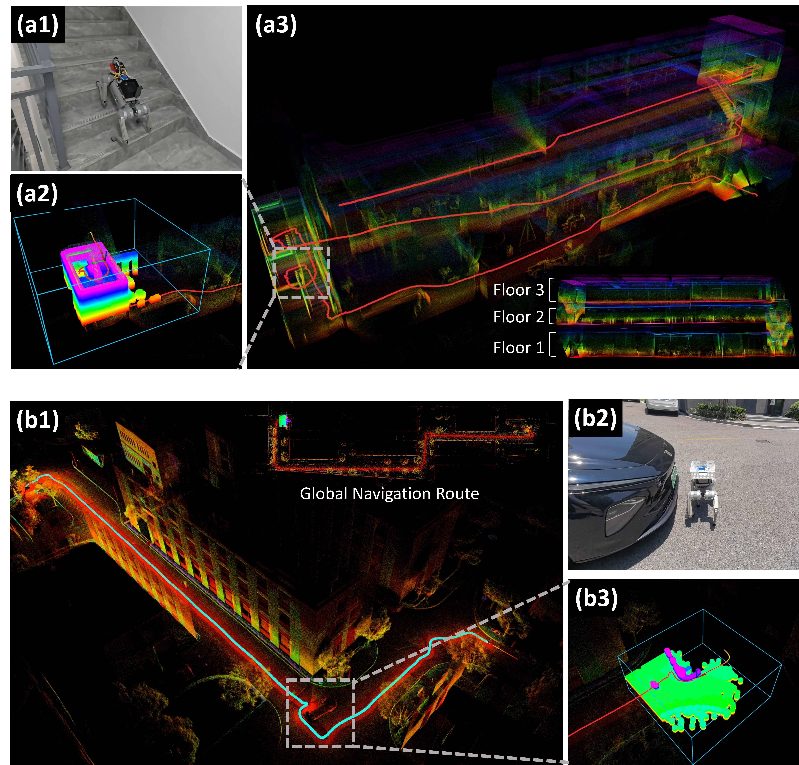
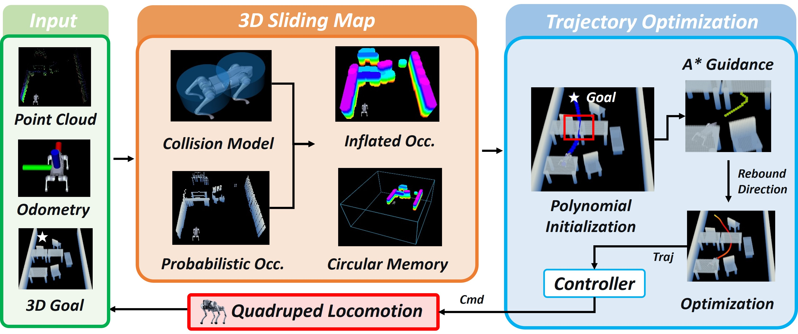

  <h1>SCAN-Planner</h1>
  <h2>Spatial Collision-Aware Local Planning for Route-Guided Long-Range Quadruped Navigation</h2>
  

    Han Zheng,
    Zhe Chen,
    Yiwen Fu,
    Ming Yang,
    Tong Qin*
  

  
  
  
   
  
<em>Code will be updated soon！</em>

  

  SCAN-Planner is a spatial collision-aware local planner, providing a <strong>robust low-level planning foundation</strong> for various upper-level tasks, such as autonomous exploration and vision-language navigation. For a VLN-related work, please refer to <a href="https://github.com/wuyi2121/TravExplorer" target="_blank">TravExplorer</a>.

## System Overview

  

## Demonstrations

<table>
  <tr>
    <td align="center" width="50%">
      
    </td>
    <td align="center" width="50%">
      
    </td>
  </tr>
  <tr>
    <td align="center" width="50%">
      
    </td>
    <td align="center" width="50%">
      
    </td>
  </tr>
</table>

More videos and interactive demonstrations are available on the
<a href="https://wuyi2121.github.io/SCAN-Planner/" target="_blank">project page</a>.

## Citation

Citation information will be added once the paper is available.

## License

This project is licensed under the Apache License 2.0. See [LICENSE](LICENSE) for details.
